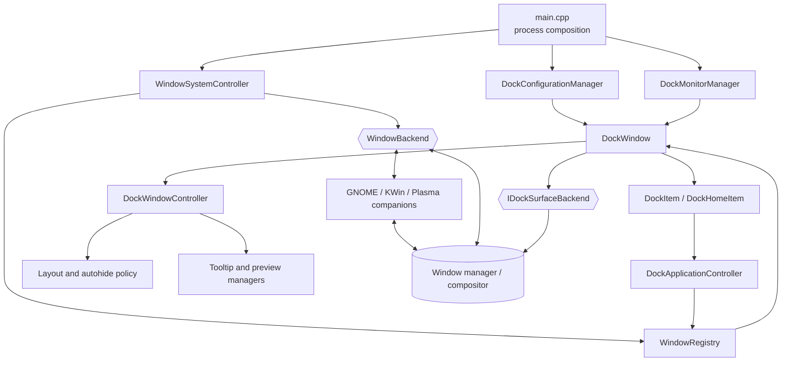

# DockLight 6 architecture

This document describes the current DockLight 6 codebase, its runtime
composition, and the responsibilities of its modules. DockLight is a native,
single-process GTK application with optional per-desktop companion components;
it is not a conventional frontend/server application.

## Table of contents

- [Architectural overview](#architectural-overview)
- [Runtime composition](#runtime-composition)
- [Startup and lifetime](#startup-and-lifetime)
- [The three platform boundaries](#the-three-platform-boundaries)
  - [Presentation selection](#presentation-selection)
  - [Application-window integration](#application-window-integration)
  - [Dock-surface placement](#dock-surface-placement)
- [Core code modules](#core-code-modules)
  - [Process and application](#process-and-application)
  - [Configuration](#configuration)
  - [Window model](#window-model)
  - [Desktop integrations](#desktop-integrations)
  - [Dock UI and coordination](#dock-ui-and-coordination)
  - [Layout](#layout)
  - [Autohide](#autohide)
  - [Launchers](#launchers)
  - [Previews and media](#previews-and-media)
  - [Monitors, rendering, and dialogs](#monitors-rendering-and-dialogs)
- [Desktop companion components](#desktop-companion-components)
- [Important data and control flows](#important-data-and-control-flows)
- [Persistent data](#persistent-data)
- [Build, generated code, and installation](#build-generated-code-and-installation)
- [Tests](#tests)
- [Architectural rules for changes](#architectural-rules-for-changes)
- [Related documentation](#related-documentation)

## Architectural overview

DockLight separates desktop-specific mechanics from its application model and
GTK widgets. Native window state is normalized into `ManagedWindow` values by
one `WindowBackend`. `WindowRegistry` turns those values into ordered
application groups. The dock UI consumes that stable model and sends actions
back through the same boundary.

The application is signal-driven. GTK/GLib owns the main event loop; sigc++
signals, Gio file monitoring, D-Bus callbacks, Wayland callbacks, and GTK
events propagate changes. Long-running work such as native capture and
PipeWire frame processing stays out of widget policy.

The main design layers are:

1. **Process composition** selects presentation and constructs long-lived
   services.
2. **Desktop-neutral domain code** represents windows, applications,
   configuration, layout, and action policy.
3. **Desktop integrations** translate GNOME Shell, KWin, or EWMH state into
   the domain model.
4. **Presentation code** owns GTK surfaces, interaction, previews, and visual
   effects.
5. **Companion desktop packages** run inside GNOME Shell, KWin, or Plasma when
   ordinary application APIs cannot provide the required functionality.

## Runtime composition



Ownership follows construction order:

- `main.cpp` owns the process application, configuration manager, monitor
  manager, `WindowSystemController`, and `DockWindow` for the application
  lifetime.
- `WindowSystemController` uniquely owns the selected `WindowBackend`, its
  `WindowRegistry`, and, for Shell-protocol integrations, the D-Bus service.
- `DockWindow` owns its GTK children, `LauncherManager`, surface backend, and
  `DockWindowController`.
- `DockWindowController` owns the autohide controller and focused layout,
  tooltip, and preview coordinators.
- UI policy objects borrow `WindowRegistry`; they do not own native windows.

## Startup and lifetime

`src/main.cpp` performs startup in this order:

1. Initialize logging, locale, and the gettext domain.
2. Parse `--list-monitors` and presentation options.
3. Resolve and prepare native GTK or XWayland presentation **before GTK is
   initialized**.
4. Initialize GTK and ensure the configuration file is current.
5. Create a plain `Gio::Application`, claim `org.docklight6`, and exit through
   remote activation if another DockLight instance already owns it.
6. Detect the desktop and start `WindowSystemController`.
7. Load application CSS and select the configured monitor.
8. Construct `DockWindow` with a complete configuration snapshot, the selected
   monitor, the optional registry, and startup diagnostics.
9. Connect configuration, monitor, and secondary-activation signals.
10. Start file and monitor observation, hold the process application, show the
    dock, and enter the GLib application loop.

A second invocation does not create a second dock. Its application activation
is delivered to the primary process, which requests that the existing dock be
revealed. Temporary unmapping during a monitor move also does not terminate
the process because the application holds itself independently of window map
state.

## The three platform boundaries

DockLight makes three independent platform decisions. They must not be
conflated when adding a desktop or debugging a session.

### Presentation selection

`src/presentation/presentation_selector.*` chooses how DockLight's own GTK
windows connect to the display server:

- `native` uses the session's native GTK backend.
- `xwayland` presents DockLight through XWayland inside a Wayland session.
- `auto` currently prefers XWayland on GNOME Wayland when it is available and
  native presentation elsewhere.

The persisted choice lives in `presentation.conf`. Surface roles and
layer-shell namespaces are centralized in
`src/presentation/docklight_surface_identity.h` so compositor integrations can
distinguish the dock from tooltip, preview, reveal, and dialog surfaces.

Presentation does not select the window-management integration. For example,
GNOME Shell can remain the application-window backend while DockLight itself
is presented through XWayland.

### Application-window integration

`WindowSystemController` selects exactly one implementation of
`WindowBackend`:

| Session | Selected implementation | Native bridge |
| --- | --- | --- |
| KDE Plasma Wayland | `KWinWindowBackend` | Versioned session D-Bus service and KWin script |
| GNOME Shell Wayland | `GnomeWaylandWindowBackend` | Shared versioned D-Bus service and GNOME Shell extension |
| KWin X11 | `KWinX11WindowBackend` | libwnck, Xlib, and EWMH |
| MATE/Marco or Metacity X11 | `MarcoWindowBackend` | Shared EWMH base with restore specialization |
| Cinnamon/Muffin X11 | `MuffinWindowBackend` | Shared EWMH base with Cinnamon action specialization |
| GNOME Shell X11 | `GnomeX11WindowBackend` | `MutterWindowBackend` EWMH/XComposite behavior plus optional main-dock-only Shell animation bridge |
| Standalone Mutter X11 | `MutterWindowBackend` | Shared EWMH base and native XComposite capture |
| LXDE/LXQt Openbox X11 | `OpenboxWindowBackend` | Shared EWMH base with group-hide behavior |
| XFCE/xfwm4 X11 | `Xfwm4WindowBackend` | Shared EWMH base with restore specialization |
| Other EWMH-compatible X11 | `EwmhFallbackWindowBackend` | Generic EWMH behavior |
| Other Wayland compositor | No backend | Dock UI runs without desktop window control |

This boundary concerns other applications' windows: discovery, grouping,
activation, state changes, commands, stacking, workspaces, and compositor
geometry. It does not place DockLight's own GTK surface.

### Dock-surface placement

`IDockSurfaceBackend` isolates placement and screen-reservation side effects
for the main dock surface:

- `PlasmaWaylandDockSurfaceBackend` uses gtk-layer-shell anchors, monitor
  selection, margins, exclusive zones, and native Plasma Wayland effects.
- `LegacyDockSurfaceBackend` owns ordinary GTK toplevel placement, X11
  work-area/strut behavior, and compatibility paths used outside native Plasma
  Wayland.

`create_dock_surface_backend()` selects the Plasma implementation only for a
native KDE Wayland display with layer-shell support. This interface is
deliberately separate from `WindowBackend`: changing where the dock is drawn
must not change how application windows are observed.

## Core code modules

### Process and application

| Module | Responsibility |
| --- | --- |
| `src/main.cpp` | Process entry point, option parsing, subsystem construction, signal wiring, and main-loop entry. |
| `src/application/dock_process_application.*` | Single-instance `Gio::Application`, activation, and GTK window identity without `GtkApplication` session management. |
| `src/application/dock_runtime_info.h` | Plain startup-diagnostic snapshot passed to user-facing surfaces. |
| `src/application/dock_application_controller.*` | Desktop-neutral policy for activate, cycle, minimize, maximize, close, present, and hide actions on one application group. |
| `src/docklight_log.*` | Startup logging and release diagnostic filtering. |

### Configuration

| Module | Responsibility |
| --- | --- |
| `src/config/dock_settings.*` | Validated typed runtime settings such as monitor, icon size, previews, effects, colors, and workspace policy. |
| `src/config/dock_configuration.h` | Atomic value combining `DockSettings` with a `DockLayoutRequest`. |
| `src/config/dock_configuration_manager.*` | Creates, migrates, parses, validates, saves, and monitors the per-user configuration file; emits complete snapshots after coalesced changes. |

Consumers should use typed snapshots rather than parse configuration text or
independently infer defaults.

### Window model

| Module | Responsibility |
| --- | --- |
| `src/windowing/managed_window.h` | Backend-independent window ID, metadata, geometry, workspace/activity membership, and state. |
| `src/windowing/running_application.h` | Desktop-file identity plus the ordered window IDs and active member of an application group. |
| `src/windowing/window_icon_geometry.h` | Transport-neutral screen rectangle for launcher icons and the dock surface. |
| `src/windowing/window_backend.*` | Abstract capabilities, snapshots, actions, connection state, and change signals implemented by every desktop backend. |
| `src/windowing/window_registry.*` | Mirrors backend state, canonicalizes desktop-file identities, groups windows, preserves stacking and active state, guards actions by capability, and exposes one stable model to UI code. |

`WindowBackend` is the primary platform boundary. Backend code must normalize
native objects before notifying the registry; libwnck objects, XIDs, KWin
objects, and D-Bus payloads must not leak into widgets or application policy.

### Desktop integrations

| Module | Responsibility |
| --- | --- |
| `src/integrations/window_system_controller.*` | Detects the session, selects and owns the backend stack, controls startup/shutdown order, and reports runtime details. |
| `src/integrations/desktop_session_identity.h` | Shared GNOME Shell/Flashback identity classification. |
| `src/integrations/gnome/gnome_wayland_window_backend.*` | Specializes the script-backed backend with GNOME's actual capability set. |
| `src/integrations/kwin/kwin_window_backend.*` | Stages and atomically commits revisioned snapshots and translates generic actions into queued commands. |
| `src/integrations/kwin/kwin_integration_service.*` | Owns the session D-Bus name, validates the script sender, receives state, queues commands, and publishes icon/dock geometry. |
| `src/integrations/kwin/kwin_protocol_codec.*` | Stateless parsing, validation, and encoding at the D-Bus boundary. |
| `src/integrations/kwin/kwin_integration_protocol.h` | Shared protocol version and stable D-Bus identifiers. Protocol changes must be synchronized with companion scripts. |
| `src/integrations/kwin/kwin_window_command.h` | Plain command type between generic window actions and Shell transport. |
| `src/integrations/kwin/kwin_script_manager.*` | Locates and restarts the installed KWin script through KWin's scripting API. |
| `src/integrations/x11/ewmh_window_backend.*` | Common libwnck/EWMH discovery, snapshots, actions, workspace transitions, and signals. |
| `src/integrations/x11/*_window_backend.*` | Small window-manager-specific specializations over the EWMH base. |
| `src/integrations/x11/x11_backend_selection.*` | Pure classification of window-manager and desktop identity. |
| `src/integrations/plasma/plasma_geometry_bridge_manager.*` | Detects an installed geometry bridge and asks Plasma to create or repair its hidden instance. |

### Dock UI and coordination

| Module | Responsibility |
| --- | --- |
| `src/dock/dock_window.*` | Main GTK surface and item container; owns launchers, running-app synchronization, ordering, drag-and-drop, styling, and the selected surface backend. |
| `src/dock/dock_window_controller.*` | Façade coordinating layout, autohide, tooltips, previews, icon refresh, and compositor geometry publication. Coalesces expensive GTK reactions. |
| `src/dock/dock_item.*` | One application's launcher widget, indicators, menus, pointer/scroll/drag events, and icon-geometry reporting. Delegates group actions to `DockApplicationController`. |
| `src/dock/dock_home_item.*` | Home icon and dock-wide settings, about, quit, and global window actions. |
| `src/dock/dock_tooltip_window.*` | Non-interactive tooltip GTK surface and its visual presentation. |
| `src/dock/tooltip_manager.*` | Tooltip intent, delays, placement, pointer state, and cross-overlay signals. |
| `src/dock/preview_manager.*` | Preview intent, delayed reveal, action controller, media monitor, preview surface, and autohide inhibition. |
| `src/dock/layout_coordinator.*` | Resolves compositor output and work-area reports into coordinate spaces used for dock, tooltip, and preview layout. |
| `src/dock/backends/*` | Main-surface placement and reservation implementations described above. |
| `src/dock/dock_constants.h` | Shared interaction delays, limits, and stable drag identifiers. |
| `src/style.css` | Shared GTK styling loaded by the process. |

### Layout

| Module | Responsibility |
| --- | --- |
| `src/layout/dock_layout_types.h` | Plain orientation, edge, alignment, autohide, request, monitor, item, position, and placement values. |
| `src/layout/dock_window_geometry.h` | Realized dock position and dimensions without a widget dependency. |
| `src/layout/dock_layout_engine.*` | Pure dock and tooltip placement calculations plus work-area insets. |
| `src/layout/dock_layout_geometry.*` | Adapter that reads GTK allocations and monitor geometry into plain values. |
| `src/layout/dock_layout_metrics.*` | Shared size baselines and pure scaling helpers. |

Keep calculations that can be expressed using value types in the layout
engine or metrics modules. GTK reads belong in `DockLayoutGeometry`; placement
side effects belong in a dock-surface backend.

### Autohide

| Module | Responsibility |
| --- | --- |
| `src/autohide/dock_autohide_controller.*` | Visibility lifecycle, configured effect, delays, pointer state, reveal coordination, inhibition, and compositor handshakes. |
| `src/autohide/dock_intellihide_policy.*` | Pure decision about whether eligible managed windows overlap the dock. |
| `src/autohide/dock_reveal_window.*` | Transparent fallback edge surface that emits reveal requests when the pointer enters. Native Plasma Wayland uses KWin's screen-edge reservation instead. |

GTK owns autohide/intellihide policy and final visibility state. GNOME Shell or
KWin may own compositor animation, edge activation, and native pointer/geometry
reporting where the application cannot implement them directly. GNOME Shell
X11 delegates only the `GNOME` animation: its GTK reveal trigger and all
EWMH/XComposite behavior remain native and provide the fallback path.

### Launchers

`src/launchers/launcher_manager.*` discovers installed `Gio::AppInfo` desktop
entries, normalizes IDs, maintains the pinned launcher order, persists attach,
detach, and reorder operations atomically, and invalidates its cache when the
desktop application database changes.

### Previews and media

| Module | Responsibility |
| --- | --- |
| `src/preview/dock_preview_window.*` | Interactive grouped-window preview cards, placement, cached frames, animations, and window actions. |
| `src/preview/dock_window_thumbnail_provider.*` | Asynchronous static capture through XComposite/XRender, KWin `ScreenShot2`, or the GNOME Shell thumbnail service. |
| `src/preview/dock_window_stream_provider.*` | Persistent KWin Wayland window streams using the KDE screencast protocol and PipeWire frame transport. |
| `src/media/dock_media_playback_monitor.*` | Watches MPRIS services and reports whether a launcher is actively playing media, informing live-stream policy. |

The backend advertises a `WindowThumbnailPolicy`; preview code uses the policy
instead of identifying a window manager itself. Capture providers own native
resources and asynchronous cancellation. GTK preview widgets receive pixbufs,
not native capture handles.

### Monitors, rendering, and dialogs

| Module | Responsibility |
| --- | --- |
| `src/monitors/dock_monitor_manager.*` | Monitor discovery, configured selection, primary fallback, topology observation, and stabilized geometry/work-area/scale notifications. |
| `src/rendering/dock_icon_renderer.*` | Stateless highlighted, zoom, and blur pixbuf generation; animation scheduling remains in `DockItem`. |
| `src/dialogs/dock_settings_dialog.*` | Builds controls from typed configuration and commits accepted changes through the configuration manager. |
| `src/dialogs/dock_about_dialog.*` | Presents application and runtime backend information. |

## Desktop companion components

The core `make install` target and per-user desktop integration setup are
separate. Companion components are installed with `setup_backend.sh` or the
corresponding explicit make target.

| Directory | Component | Role |
| --- | --- | --- |
| `gnome/docklight-window-integration@docklight6/` | GNOME Shell extension | Publishes normalized Mutter state, executes window commands, captures or presents previews, places DockLight surfaces, and performs compositor-owned autohide animation. `placement.js` contains independently testable geometry helpers. |
| `kwin/org.docklight6.windowintegration/` | KWin workspace script | Tracks KWin windows and dock geometry, registers outer compositor screen edges, detects internal monitor-boundary crossings, sends revisioned snapshots over session D-Bus, waits for commands, and reports pointer/animation state. |
| `kwin/org.docklight6.minimize/` | Optional KWin effect | Animates windows toward DockLight launcher geometry while coexisting with other docks. |
| `plasma/geometry-bridge/package/` | Hidden Plasma applet | Uses Plasma's task model to publish launcher geometry through Plasma's private window-management path. |
| `plasma/geometry-bridge/plugin/` | Qt 6 QML plug-in | Watches DockLight's D-Bus service and exposes icon and surface geometry to the applet. |
| `plasma/geometry-bridge/ensure-geometry-bridge.js` | Plasma repair script | Ensures exactly one hidden applet instance exists on a suitable panel. |
| `protocols/zkde-screencast-unstable-v1.xml` | Wayland protocol description | Generates the client code used for KWin live preview streams. |

The integration service advertises the current protocol from the C++ header
and accepts one legacy version during producer upgrades. A producer may remain
on that legacy version only when capability gating preserves its existing
fallback behavior, as GNOME does for KWin-specific screen-edge reveal. Shared
wire-format changes must update both producers and their contract tests.

## Important data and control flows

### Window state and actions

```text
Window manager / Shell
    -> concrete WindowBackend
    -> WindowRegistry
    -> DockWindow and DockItem state
    -> user action
    -> DockApplicationController
    -> WindowRegistry capability guard
    -> concrete WindowBackend
    -> window manager / Shell
```

KWin and GNOME use revisioned snapshots and commands over the session D-Bus
service. X11 implementations translate directly between libwnck/EWMH and the
same generic API.

### Configuration and monitor changes

```text
docklight.conf -> DockConfigurationManager -> complete DockConfiguration
                                              -> DockWindow
                                              -> DockWindowController

GDK topology -> DockMonitorManager -> stable selected monitor -> DockWindow
```

Configuration changes are atomic snapshots. Monitor notifications are delayed
until transient compositor geometry has stabilized. Both ultimately schedule
coalesced layout work rather than immediately performing repeated GTK side
effects.

### Placement and geometry publication

```text
DockSettings + DockLayoutRequest + monitor/work area
    -> LayoutCoordinator / DockLayoutEngine
    -> DockPlacement
    -> IDockSurfaceBackend
    -> realized dock surface
    -> DockWindowController icon geometry update
    -> WindowRegistry / WindowBackend
    -> KWin effect or Plasma/GNOME companion
```

This loop lets compositor animations minimize windows toward the correct dock
icon while preserving desktop-neutral layout calculations.

### Preview acquisition

```text
DockItem hover -> PreviewManager -> DockPreviewWindow
    -> thumbnail provider -> XComposite, KWin ScreenShot2, or GNOME service
    -> stream provider    -> KDE screencast protocol -> PipeWire
    -> pixbuf frame       -> GTK preview card
```

The preview manager also inhibits autohide while a preview is active and waits
for a hidden dock to finish revealing before calculating overlay placement.

## Persistent data

Default per-user files are stored below the XDG configuration directory:

| Path | Contents |
| --- | --- |
| `~/.config/docklight6/docklight.conf` | Main validated settings and layout configuration. |
| `~/.config/docklight6/docklight.data` | Attached launcher IDs and order. |
| `~/.config/docklight6/presentation.conf` | Native/XWayland presentation choice. |

Desktop companions use their environment's normal per-user package and
configuration locations. They communicate with DockLight through session
D-Bus rather than the main configuration file.

## Build, generated code, and installation

DockLight uses Autoconf and Automake with C++17:

- `configure.ac` declares GTKmm 3, gtk-layer-shell, PipeWire, Wayland,
  libwnck, GDK X11, Xlib, XComposite, XRender, gettext, and wayland-scanner
  requirements.
- `src/Makefile.am` declares the executable, source modules, generated Wayland
  client files, and compiled/JavaScript tests.
- `Makefile.am` declares translations, installed desktop data and icons,
  packaged Plasma helper data, Shell package distribution, integration install
  targets, and top-level script tests.
- `autogen.sh` regenerates and configures an out-of-source build.
- `build.sh` manages debug/release build directories, checks, installation,
  and optional launch/debug workflows.

`wayland-scanner` generates
`zkde-screencast-unstable-v1-client-protocol.h` and
`zkde-screencast-unstable-v1-protocol.c` in the build tree. Generated files are
build products and must not be edited directly.

Core installation places the executable, desktop file, icon, helper data, and
translations under the configured prefix. `setup_backend.sh` separately
installs the required GNOME or Plasma/KWin user integration. Optional Plasma
geometry and minimize-effect packages have their own install paths and build
requirements.

## Tests

Tests are split by boundary:

- C++ unit tests cover application action policy, pure layout/intellihide,
  configuration, rendering, process uniqueness, launcher persistence,
  presentation selection, backend selection, registry behavior, KWin codec,
  backend state, and D-Bus service behavior.
- `src/tests/fake_window_backend.*` is the deterministic in-memory test double
  for registry and action-policy tests.
- JavaScript contract tests exercise GNOME placement, KWin integration and
  surface identity, the KWin minimize effect, Plasma geometry, and
  WM-specific restore/minimize behavior.
- Top-level shell tests cover build-script behavior, backend setup,
  presentation setup, and presentation validation.

Run the complete assertion-enabled suite with:

```sh
./build.sh debug --clean --check
```

When a protocol or cross-language contract changes, update both sides and its
JavaScript/C++ contract tests in the same change.

## Architectural rules for changes

- Keep desktop-native objects and wire payloads behind `WindowBackend` or a
  capture provider.
- Add a capability flag when higher layers need to branch on supported
  behavior; do not make UI code identify KWin, Mutter, or an X11 WM by name.
- Keep presentation choice, application-window integration, and dock-surface
  placement independent.
- Prefer complete immutable snapshots at configuration and integration
  boundaries; reject stale or partial revisioned state.
- Put pure geometry and policy in value-based modules, GTK reads in adapters,
  and native side effects in backend implementations.
- Preserve explicit ownership and teardown order for signal connections,
  timers, D-Bus registrations, Wayland objects, and PipeWire resources.
- Coalesce file, monitor, registry, and allocation events before expensive GTK
  relayout or capture work.
- Keep per-user desktop package installation out of the privileged core
  install path.

## Related documentation

- [`../README.md`](../README.md) provides installation, supported-session, and
  user-facing behavior information.
- [`../SETUP.md`](../SETUP.md) documents build, test, installation, and backend
  setup workflows.
- [`frontend-backend-architecture.md`](frontend-backend-architecture.md)
  provides focused frontend/backend diagrams.
- [`../gnome/README.md`](../gnome/README.md) describes GNOME Shell integration
  and presentation details.
- [`../plasma/geometry-bridge/README.md`](../plasma/geometry-bridge/README.md)
  describes the optional Plasma geometry bridge.
