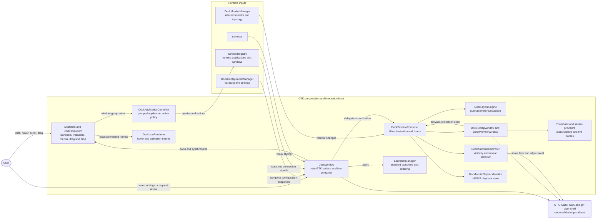

# DockLight frontend and backend architecture

DockLight is a native desktop application rather than a client/server system.
In these diagrams, **frontend** means the GTK presentation and interaction
layer, while **backend** means the desktop-neutral window model and the
desktop-specific integrations used to observe and control windows.

## Frontend

The main UI boundary is `WindowRegistry`: widgets and application policy use
normalized windows and capabilities, without depending on KWin, GNOME Shell,
D-Bus, X11 IDs, or libwnck objects. Preview image acquisition is intentionally
kept behind thumbnail and stream providers.

## Backend

```mermaid
flowchart TB
    frontend[Frontend<br/>DockWindow and DockApplicationController]

    subgraph core[Desktop-neutral backend core]
        controller[WindowSystemController<br/>detect environment and own lifecycle]
        registry[WindowRegistry<br/>normalize, group and cache window state]
        backendApi{{WindowBackend interface<br/>capabilities, snapshots, actions and signals}}
    end

    subgraph selection[Runtime-selected implementation]
        kde[KWinWindowBackend<br/>KDE Plasma Wayland]
        gnome[GnomeWaylandWindowBackend<br/>GNOME Shell on Wayland or X11]
        x11[EWMH X11 backends<br/>KWin, Marco, Muffin, Mutter,<br/>Openbox, Xfwm4 or fallback]
        none[No window backend<br/>unsupported Wayland session]
    end

    subgraph bridges[Desktop integration bridges]
        service[KWinIntegrationService<br/>versioned session D-Bus transport]
        kwinScript[KWin workspace script]
        gnomeExtension[GNOME Shell extension]
        plasmaBridge[Optional Plasma geometry bridge<br/>and minimize effect]
        x11Stack[libwnck, Xlib and EWMH]
    end

    subgraph preview[Preview acquisition]
        thumbnail[DockWindowThumbnailProvider]
        stream[DockWindowStreamProvider]
        xCapture[XComposite and XRender]
        shellCapture[GNOME thumbnail and live-preview D-Bus API]
        kdeShot[KWin ScreenShot2]
        kdeStream[KDE screencast protocol]
        pipewire[PipeWire frame transport]
    end

    desktops[(Desktop windows,<br/>window manager and compositor)]

    controller -->|constructs and starts| registry
    registry -->|uses| backendApi
    controller -->|selects one| kde
    controller -->|selects one| gnome
    controller -->|selects one| x11
    controller -.->|unsupported session| none

    kde -. implements .-> backendApi
    gnome -. implements .-> backendApi
    x11 -. implements .-> backendApi

    frontend -->|queries and window actions| registry
    registry -->|normalized state signals| frontend

    kde <--> service
    gnome <--> service
    service <-->|snapshots and commands| kwinScript
    service <-->|snapshots and commands| gnomeExtension
    service -->|icon and dock geometry| plasmaBridge
    x11 <--> x11Stack

    kwinScript <--> desktops
    gnomeExtension <--> desktops
    plasmaBridge <--> desktops
    x11Stack <--> desktops

    frontend -->|thumbnail requests| thumbnail
    frontend -->|live stream requests| stream
    thumbnail --> xCapture
    thumbnail --> shellCapture
    thumbnail --> kdeShot
    stream --> kdeStream
    xCapture --> desktops
    shellCapture <--> gnomeExtension
    kdeShot <--> desktops
    kdeStream <--> desktops
    kdeStream -->|PipeWire node| pipewire
    pipewire -->|frames| stream
    stream -->|decoded frames| frontend
    thumbnail -->|pixbuf results| frontend
```

`WindowSystemController` selects exactly one window backend at startup. All
supported implementations terminate at the same `WindowBackend` contract, so
`WindowRegistry` can expose one stable model to the frontend. Unsupported
Wayland sessions still create the dock UI, but do not provide window-management
integration.

## Source map

| Area | Primary source |
| --- | --- |
| Process composition | `src/main.cpp` |
| Process lifecycle, uniqueness, and shell identity | `src/application/dock_process_application.*` |
| Main dock surface | `src/dock/dock_window.*` |
| UI orchestration | `src/dock/dock_window_controller.*` |
| Application action policy | `src/application/dock_application_controller.*` |
| Desktop-neutral window model | `src/windowing/window_registry.*` |
| Backend contract | `src/windowing/window_backend.*` |
| Backend detection and selection | `src/integrations/window_system_controller.*` |
| Desktop-specific integrations | `src/integrations/gnome/`, `src/integrations/kwin/`, `src/integrations/x11/` |
| Preview capture and streaming | `src/preview/` |
| Companion desktop components | `gnome/`, `kwin/`, `plasma/` |
